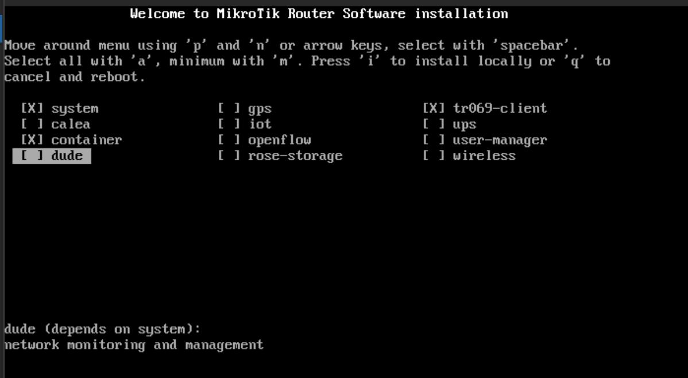
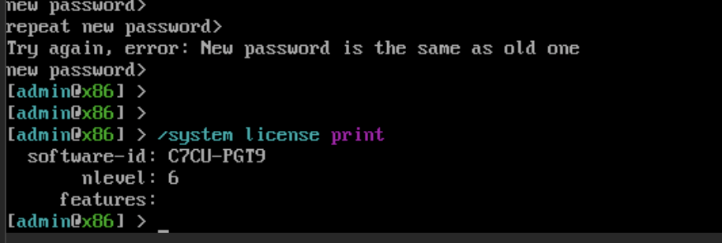
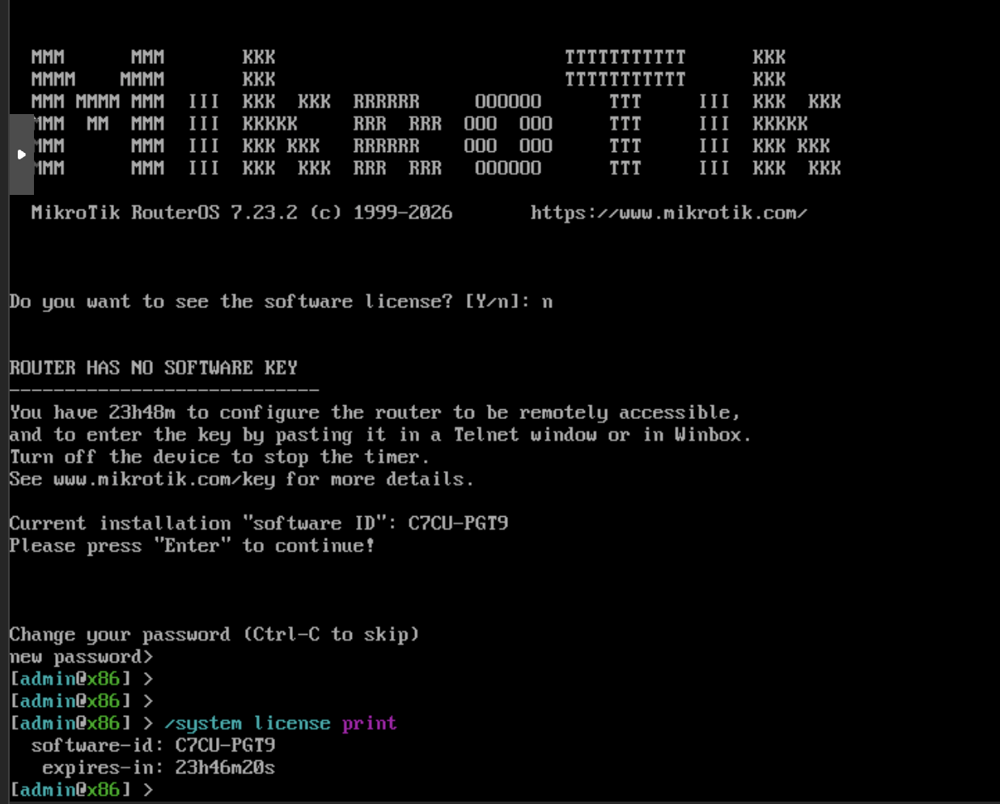

# 64G RouterOS L6 授权镜像制作（PVE + qcow2）

> 全程在 PVE 上操作，系统文件 100% 来自 MikroTik 官方 ISO，仅修改 MBR 80 字节授权数据。

---

## 授权参数

| 参数 | 值 |
|---|---|
| 磁盘型号（Model） | `SSD64G2016` |
| 序列号（Serial） | `HYSSD-20160419B79028` |
| 磁盘大小 | 64,023,257,088 bytes（125,045,424 扇区 × 512） |
| SOFTWARE ID | `C7CU-PGT9` |

---

## Step 1：上传 ISO

PVE Web UI → Datacenter → Storage（local）→ ISO Images → Upload RouterOS 官方 ISO。

---

## Step 2：创建虚拟机

PVE Web UI → Create VM：

| 设置项 | 值 |
|---|---|
| VM ID | `923` |
| OS Type | Linux, 6.x - 2.6 Kernel |
| ISO Image | `mikrotik-7.23.2.iso` |
| BIOS | **OVMF (UEFI)** |
| EFI Storage | local-lvm（勾选 Add EFI Disk） |
| CPU | 1 核 |
| 内存 | 256 MB |
| 磁盘 | 随便建一个（后面替换） |

创建后不要启动。

---

## Step 3：替换为精确大小的 qcow2 磁盘

```bash
qm set 923 --delete scsi0

mkdir -p /var/lib/vz/images/923
qemu-img create -f qcow2 /var/lib/vz/images/923/vm-923-disk-ros.qcow2 64023257088
```

---

## Step 4：配置磁盘身份参数

编辑 `/etc/pve/qemu-server/923.conf`，删除自动生成的磁盘行，添加：

```conf
args: -drive file=/var/lib/vz/images/923/vm-923-disk-ros.qcow2,format=qcow2,if=none,id=drive0 -device ide-hd,drive=drive0,serial=HYSSD-20160419B79028,model=SSD64G2016
```

---

## Step 5：安装 RouterOS

1. PVE Web UI → 启动 VM → 打开控制台
2. `a` 全选可选包 → `i` install → `y` 确认格式化




3. 安装完成后 **Stop 关机**（不要重启）

---

## Step 6：写入 MBR 授权数据

```bash
modprobe nbd max_part=8
qemu-nbd --connect=/dev/nbd0 /var/lib/vz/images/923/vm-923-disk-ros.qcow2
sleep 1

echo -n '00000000000000000000BDE800000000F4E11772DEEAED8AF43668DA5EBDAD0846B694FFE9E77EFAE77E11A6049E4303B0B09DCEF8D9A647D643D1BAD4AF13B9659CCB11A06D3A9080096634E4E88B07' \
  | xxd -r -p \
  | dd of=/dev/nbd0 bs=1 seek=256 count=80 conv=notrunc

hexdump -C -s 0x100 -n 80 /dev/nbd0
qemu-nbd --disconnect /dev/nbd0
```

验证 `0x10A-0x10B` 为 `bd e8`：

```
00000100  00 00 00 00 00 00 00 00  00 00 bd e8 00 00 00 00
00000110  f4 e1 17 72 de ea ed 8a  f4 36 68 da 5e bd ad 08
00000120  46 b6 94 ff e9 e7 7e fa  e7 7e 11 a6 04 9e 43 03
00000130  b0 b0 9d ce f8 d9 a6 47  d6 43 d1 ba d4 af 13 b9
00000140  65 9c cb 11 a0 6d 3a 90  80 09 66 34 e4 e8 8b 07
```

---

## Step 7：移除光驱，启动

```bash
qm set 923 --delete ide2
qm set 923 --boot ''
qm start 923
```

---

## Step 8：验证授权

登录 RouterOS（`admin`，密码为空）：

```
/system license print
```

```
  software-id: C7CU-PGT9
       nlevel: 6
     features:
```



---

## 实验记录：VM 920 / 921 对比验证（2026-07-20）

安装器会将 MBR `0x10A`–`0x10B` 从 `BD E8` 覆盖为 `FF FF`。

| | VM 920 | VM 921 |
|---|---|---|
| 操作 | 装系统 → 关机 → **重写 MBR** | 装系统 → **保留 FF FF** |
| `0x10A-0x10B` | `BD E8` | `FF FF` |
| SOFTWARE ID | `C7CU-PGT9` | `C7CU-PGT9`（相同） |
| 授权状态 | ✅ `nlevel: 6` | ❌ `ROUTER HAS NO SOFTWARE KEY` |

`0x10A-0x10B` 不影响 SOFTWARE ID，但影响授权签名校验。

**授权失败截图（VM 921，`FF FF`）：**


